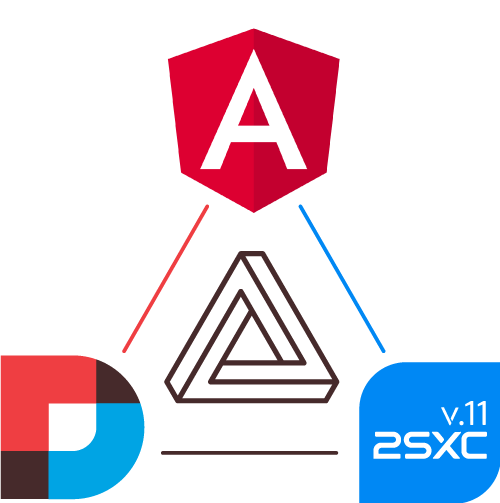

## Dnn-Sxc-Angular

This is a library to help create awesome Angular solutions in DNN. 

You can find it on NPM in [@2sic.com/dnn-sxc-angular](https://www.npmjs.com/package/@2sic.com/dnn-sxc-angular).

The current release works for Angular 6-11.

## Instructions for Using

Check out the [NPM page](https://www.npmjs.com/package/@2sic.com/dnn-sxc-angular) containing the instructions. 

## Instructions for Developers of this package

Since we only see this on irregular intervals, we had to create instructions for ourselves as well 😎.
To create new versions and releases, check out our [azing checklists](https://azing.org/2sxc/r/ItPxPh9D).

